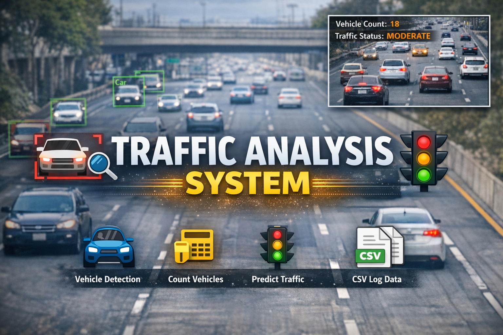

<p align="center">
  
</p>

# 🚦 AI Traffic Monitoring & Congestion Prediction System


------------------------------------------------------------------------

## 📌 Overview

This project is a real-time AI-based traffic monitoring system that
performs:

-   Vehicle detection using YOLOv8\
-   Object tracking with persistent IDs\
-   Speed estimation from video frames\
-   Overspeed violation capture\
-   Traffic density classification\
-   LSTM-based next-step traffic forecasting

The system integrates computer vision and deep learning to provide
end-to-end traffic analytics.

------------------------------------------------------------------------

# 🏗 System Architecture

## High-Level Pipeline

    Video Input
        ↓
    YOLOv8 Object Detection
        ↓
    Multi-Object Tracking
        ↓
    Centroid Extraction
        ↓
    Speed Estimation
        ↓
    Vehicle Counting
        ↓
    Traffic Classification
        ↓
    LSTM Prediction
        ↓
    Logging & Storage

------------------------------------------------------------------------

# 🧠 Core Components

## 1️⃣ Detection & Tracking

-   Model: YOLOv8 (Ultralytics)
-   Tracker: Built-in YOLO tracker
-   Classes filtered:
    -   car
    -   truck
    -   bus
    -   motorcycle

Tracking ensures stable ID assignment across frames.

------------------------------------------------------------------------

## 2️⃣ Speed Estimation (Mathematical Model)

Speed is calculated using centroid displacement between consecutive
frames.

### Step 1: Pixel Displacement

Δp = \|y_current − y_previous\|

### Step 2: Convert Pixels to Meters

meters = Δp / pixels_per_meter

### Step 3: Speed in m/s

v = meters / frame_time

### Step 4: Convert to km/h

speed_kmph = v × 3.6

Where:

-   frame_time = 1 / FPS\
-   pixels_per_meter is calibration constant

Final formula:

    speed = (pixel_distance / pixels_per_meter) / frame_time × 3.6

To reduce noise, weighted smoothing is applied:

    v_final = 0.7 × v_previous + 0.3 × v_current

------------------------------------------------------------------------

## 3️⃣ Traffic Classification Logic

Rule-based congestion classification:

  Vehicle Count   Status
  --------------- ------------------
  \< 10           FREE ROAD
  10--24          MODERATE TRAFFIC
  ≥ 25            HEAVY TRAFFIC

------------------------------------------------------------------------

## 4️⃣ LSTM-Based Traffic Forecasting

The LSTM model predicts the next vehicle count using historical sequence
data.

### Training Steps:

1.  Load dataset (traffic.csv)
2.  Sort by DateTime
3.  Normalize using MinMaxScaler
4.  Create sequences (length = 5)
5.  Train LSTM network
6.  Save model & scaler

### Model Architecture:

-   LSTM (64 units)
-   Dense (1 output)
-   Optimizer: Adam
-   Loss: Mean Squared Error

The model learns temporal patterns in traffic flow.

------------------------------------------------------------------------

# 📂 Project Structure

    Traffic_analysis-system/
    │
    ├── vehicle_detect.py
    ├── traffic_predict.py
    ├── train_traffic_model.py
    ├── traffic_lstm_model.h5
    ├── traffic_scaler.pkl
    ├── traffic.csv
    ├── traffic_log.csv
    ├── yolov8n.pt
    └── violations/

------------------------------------------------------------------------

# ⚙️ Installation

``` bash
git clone <repository-link>
cd Traffic_analysis-system
pip install opencv-python ultralytics tensorflow scikit-learn pandas joblib
```

------------------------------------------------------------------------

# ▶️ Usage

### Train Model

``` bash
python train_traffic_model.py
```

### Run Monitoring System

``` bash
python vehicle_detect.py
```

Press `Q` to exit.

------------------------------------------------------------------------

# 📊 Performance Considerations

  Model     Accuracy        Speed
  --------- --------------- ----------------
  yolov8n   Fast            Lower accuracy
  yolov8s   Balanced        Recommended
  yolov8m   High accuracy   Slower

Speed estimation accuracy depends on: - Proper calibration - Stable
FPS - Camera angle

------------------------------------------------------------------------

# 🚀 Future Improvements

-   Perspective transformation (bird's-eye view)
-   Lane-wise speed analytics
-   Web dashboard (Streamlit/Flask)
-   Custom-trained YOLO on traffic dataset
-   Advanced congestion forecasting model

------------------------------------------------------------------------

# 👨‍💻 Author

AI & Computer Vision Project focused on real-time analytics and
predictive modeling.

------------------------------------------------------------------------

# ⭐ License

This project is for educational and research purposes.
